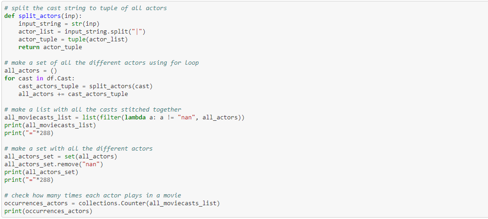

# kaggle-challenge2

## 1.Summary

Dataset: <https://www.kaggle.com/promptcloud/all-marvel-cinematic-universe-movies-on-imdb>\
Dataset that contains info about marvel movies. So who plays in it, how long, what rating, financials...
Plots are mainly about actors, rating and earnings.

## 2.Results

### Plot#1
Scatter plot with on x-axis review rating and y-axis the movie time. The colour of the dots represent the budget.\
\

### plot#2
A bar chart generated with Seaborn that displays the amount of movies made by marvel per genre.\
\

### plot#3
A bar chart generated with seaborn that displays the distribution of the ratings.\
\

### plot#4
A bar chart that displays the frequency of the actors. So many actors only play in one movie and few play in more then 3 or even 2.\
\

### plot#5
The amount of movies played by each actor.\
\

### plot#5
The amount of money the movies have collected for each of the actors.\
\

## 3.Workflow

To make the last three plots we had to make a set of all the actors and count their occurrences. So this code splits the cast cells into a tuple and then with a for loop all these tuples are stitched together so we can count later how many occurrences they have in movies.\
\

To plot the total collections of all the movies a certain actor played in we used this set of actors to iterate through every cast of every movie and then accumulate the earnings of all the movies played by the actor.\
\

### Github
We are a group of 2 (Maurice, Nathan). First we chose a fun dataset with a lot of challenge in it. So here the challenge was mainly cleaning and making the data usefull to plot. A lot of time was invested in making the data ready to plot. This was the focus of the excercise because we felt like plotting was less of a problem for us.
